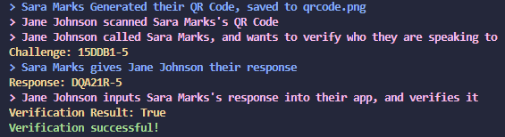
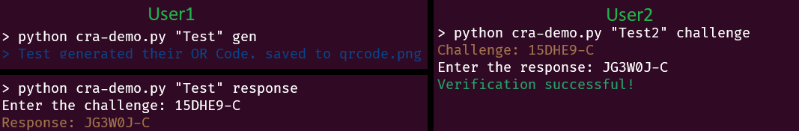

# Challenge-Response Authentication for Over-The-Phone, a Proof of Concept

## Overview

This project is a small Proof-of-Concept (POC) demonstrating a voice-based challenge-response mechanism using asymmetric encryption. 

The concept involves embedding a signature and a public key within a QR code which can be shared publicly. A user can then scan the QR code and generate a challenge that can be used for verification purposes. While the challenge doesn't have to be cryptographically secure, it's sufficient for over-the-phone verification. It includes a checksum character to handle minor errors in pronunciation or interpretation. 

This system functions well for an "over-the-phone Multi-Factor Authentication (MFA)" where voice and phone number act as additional factors contributing to the trust between two communicating parties.

However, it is strongly advised not to utilize this in real-world scenarios due to numerous cryptographic vulnerabilities. This repository is solely intended for demonstration purposes. 

### Challange-Response POC

 

### Challange-Response Demo

 

(Appologies for the garish looking output.)

## Usage
### Challange-Response POC

The main function of the script is to simulate the challenge-response authentication process. It demonstrates the creation and verification of a QR code containing the public and private RSA keys for `User1`. `User2` reads the QR code, extracts `User1`'s public key, and generates a challenge for `User1`. `User1` then creates a response for the challenge and `User2` verifies the response.

The script can be run in any Python 3.6 or later environment. 

In a terminal or command line, run the following command:
```
python3 cra-poc.py
```
It will then perform the challenge-response authentication process and print out each step along with the result of the verification.

### Challenge-Response Demo 

This POC has been developed into a functional command-line system. You can interact with the system through the command line using the following syntax:

```bash
python cra-demo.py <user_name> <command>
```

* `<user_name>`: The name of the user. 

* `<command>`: The command to execute. Can be one of the following:
  * `gen`: Generates a new QR code and key pair for the user.
  * `challenge`: Generates a new challenge for the user.
  * `response`: Verifies a response for a given challenge.

Example:

**User 1:**
```bash
python cra-demo.py "Test" gen
```
This command generates a QR code for User 1 and saves it to `qrcode.png`. This QR code should then be sent to User 2.

User 1 will then wait for the challenge from User 2:
```bash
python cra-demo.py "Test" response 
Enter the challenge: <Challange> 
Response: <Response> 
```
Upon inputting the challenge from User 2, the system generates a response which is then sent back to User 2.

**User 2:**

User 2 starts by scanning the QR code from User 1:
```bash
python cra-demo.py "Test" challenge
Challenge: <Challange> 
Enter the response: 
```
The system generates a challenge that is sent to User 1. Once User 1 sends back their response, User 2 enters it in the same running command prompt:
```bash
python cra-demo.py "Test" challenge
Challenge: <Challange> 
Enter the response: <Response> 
Verification Success/Failed
```
The system verifies the response and indicates whether it's successful.

Sure, here are the revised sections incorporating your requests:

## Dependencies

This script requires the following Python libraries:

* `argparse`
* `time`
* `rsa`
* `qrcode`
* `string`
* `pyzbar`
* `PIL`
* `colorama`

These dependencies are listed in the `requirements.txt` file. You can install them all at once by running:

```bash
pip install -r requirements.txt
```

Make sure to install these libraries before running the script.

## Structure 

### Challenge-Response POC

`cra-poc.py` is a Python script that implements a challenge-response authentication system using QR codes and RSA encryption. It defines two classes, `User1` and `User2`, representing the two users involved in the authentication process. 

In the authentication process, `User1` initiates the process by creating a QR code that embeds their public RSA key. This QR code is then shared with `User2`. Upon receiving the QR code, `User2` scans it, extracts `User1`'s public key, and generates a challenge for `User1`. `User1` responds to this challenge which is then verified by `User2`. The verification process includes a checksum character to account for minor errors in pronunciation or interpretation. This entire process effectively demonstrates a voice-based, over-the-phone, multi-factor authentication process.

### Challenge-Response Demo 

The `cra-demo.py` script extends the `cra-poc.py` script into a functional command-line system. The core functionalities of the system are encapsulated within the `AuthenticationSystem` class, which includes methods for key pair creation, QR code generation and decoding, challenge generation, response verification, and checksum calculation.

Through the command-line interface, users can generate a QR code (including the key pair), generate a challenge, and verify responses. Each user in the interaction has a unique role: `User1` initiates the process by generating a QR code and responding to challenges, while `User2` scans the QR code, generates challenges, and verifies the responses.

Please refer to the code comments for more details on each function.

## Author

The project is developed by Joseph Erdosy. This readme and the documentation on each function was generated by OpenAI's ChatGPT4. (Because I'm ~~lazy~~ efficent)
If you have any questions or suggestions, feel free to reach out or create an issue in this repository.

